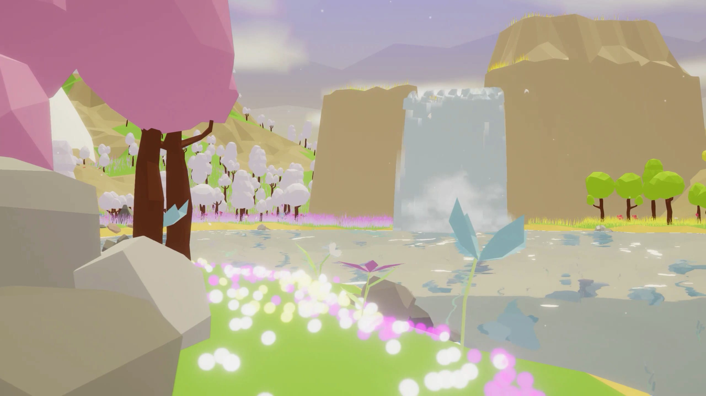
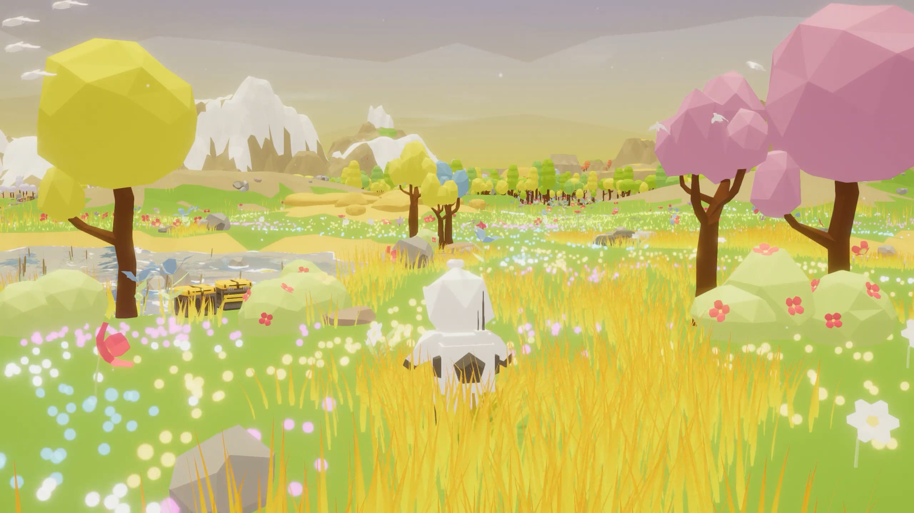

### Hi there 👋

😊 I'm Junhao. Welcome to my profile!

- Website: [junhaow.com](https://junhaow.com)
- LinkedIn: [@junhaowww](https://www.linkedin.com/in/junhaowww/)

✏️ Post: [Making Sky's Stylized Grass with Compute Shader in Unity](https://www.junhaow.com/2021/03/06/050_Stylized-Sky-grass-in-Unity/) [[Gist](https://gist.github.com/forkercat/fb6c030c17fe1e109a34f1c92571943f)] & [LeetCode Book](https://www.junhaow.com/lc/)

👾 Game: [Plan Odyssey](https://github.com/forkercat/StorageBaseWithoutCatNotice/blob/main/PlanOdyssey/%5BCS-526%5D%20Final%20Report.pdf) [[Trailer](https://www.youtube.com/watch?v=TfVEHG0-VgU&ab_channel=Forkercat) & [Demo](https://www.youtube.com/watch?v=Ie9Xrx9ZmJM&t=40s&ab_channel=Forkercat)]

     &nbsp;
     

<!--
**forkercat/forkercat** is a ✨ _special_ ✨ repository because its `README.md` (this file) appears on your GitHub profile.

Here are some ideas to get you started:

- 🔭 I’m currently working on ...
- 🌱 I’m currently learning ...
- 👯 I’m looking to collaborate on ...
- 🤔 I’m looking for help with ...
- 💬 Ask me about ...
- 📫 How to reach me: ...
- 😄 Pronouns: ...
- ⚡ Fun fact: ...
-->
