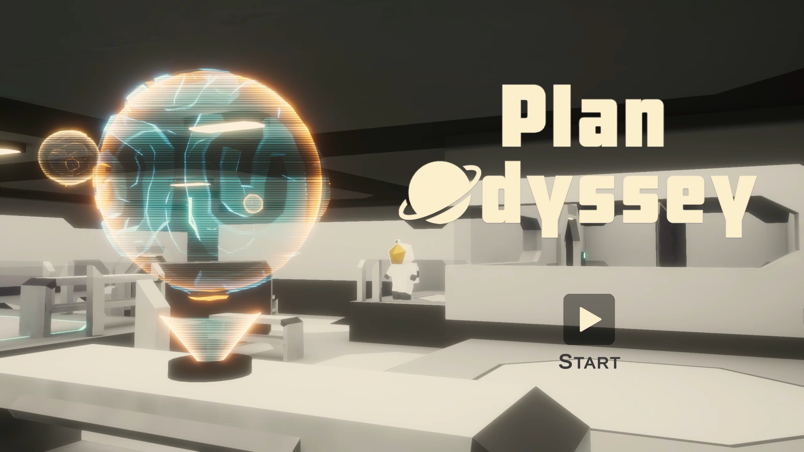
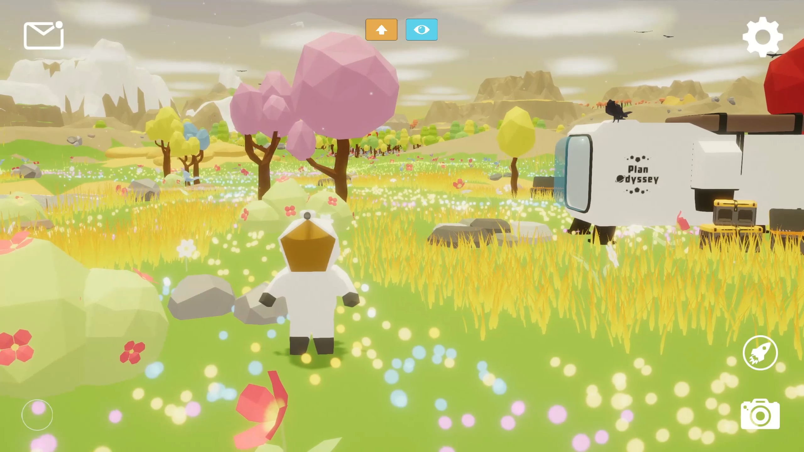

### Hi there 👋

I'm Junhao. Welcome to my profile! 😊

- Website: [junhaow.com](https://junhaow.com)
- LinkedIn: [@junhaowww](https://www.linkedin.com/in/junhaowww/)

👾 Game: [Plan Odyssey](https://github.com/forkercat/StorageBaseWithoutCatNotice/blob/main/PlanOdyssey/%5BCS-526%5D%20Final%20Report.pdf), 3D Exploration [[Trailer](https://www.youtube.com/watch?v=TfVEHG0-VgU&ab_channel=Forkercat) & [Gameplay Demo](https://www.youtube.com/watch?v=Ie9Xrx9ZmJM&t=40s&ab_channel=Forkercat)]

     &nbsp;
     &nbsp;
     

<!--
**forkercat/forkercat** is a ✨ _special_ ✨ repository because its `README.md` (this file) appears on your GitHub profile.

Here are some ideas to get you started:

- 🔭 I’m currently working on ...
- 🌱 I’m currently learning ...
- 👯 I’m looking to collaborate on ...
- 🤔 I’m looking for help with ...
- 💬 Ask me about ...
- 📫 How to reach me: ...
- 😄 Pronouns: ...
- ⚡ Fun fact: ...
-->
